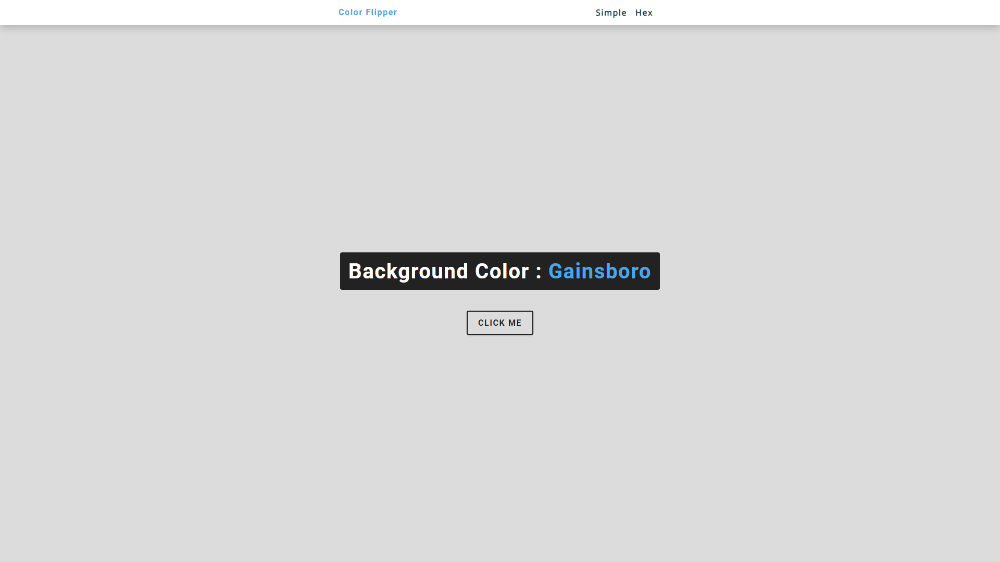
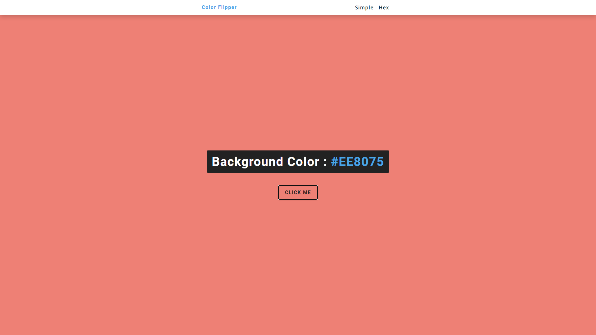

# Color-Flipper
This is a simple color flipper project in JavaScript code! 
The objective of this project is to generate a random color with one of two ways: 

Simple: Generates a random color by using and displaying the color name. 

Hex: Generates a random color by using and displaying it's hex code.  

